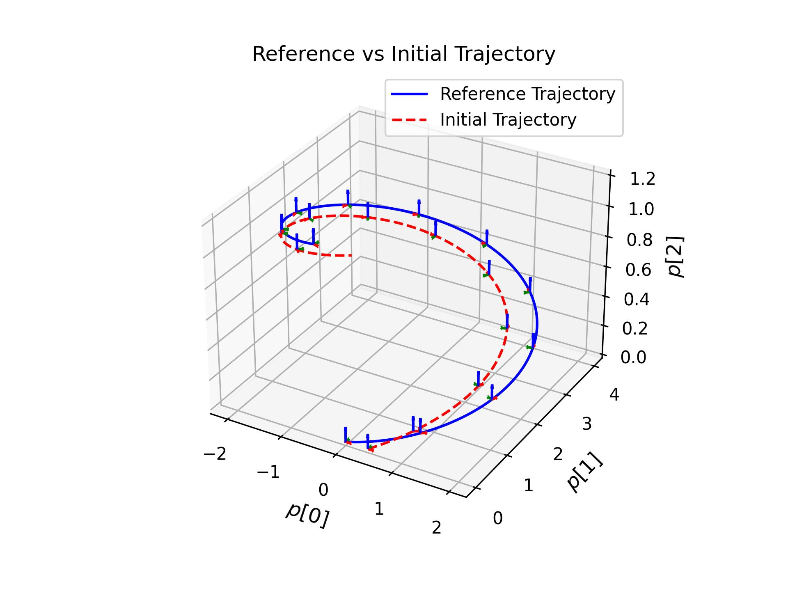
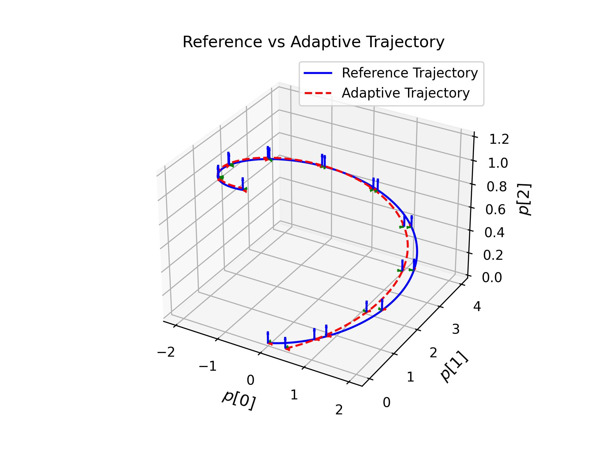

<div id="top" align="center">

# [Lie-algebra Adaptive Tracking Control for Rigid Body Dynamics]()

</div>

## Introduction
This is the official code repository of "**Lie-algebra Adaptive Tracking Control for Rigid Body Dynamics**"


[//]: # ([preprint]&#40;https://arxiv.org/abs/2403.07317&#41;, [code]&#40;https://github.com/Garyandtang/GMPC-Tracking-Control&#41;)


[//]: # (If you find this work useful, please consider citing our paper:)

[//]: # ()
[//]: # (```)

[//]: # (@misc{tang2024gmpc,)

[//]: # (      title={GMPC: Geometric Model Predictive Control for Wheeled Mobile Robot Trajectory Tracking}, )

[//]: # (      author={Jiawei Tang and Shuang Wu and Bo Lan and Yahui Dong and Yuqiang Jin and Guangjian Tian and Wen-An Zhang and Ling Shi},)

[//]: # (      year={2024},)

[//]: # (      eprint={2403.07317},)

[//]: # (      archivePrefix={arXiv},)

[//]: # (      primaryClass={eess.SY})

[//]: # (})

[//]: # (```)


### Installation
1. clone the repository:
```bash
git clone https://github.com/Garyandtang/Lie-algebra-Adaptive-Control-Single-Rigid-Body-Dynamics.git
cd Lie-algebra-Adaptive-Control-Single-Rigid-Body-Dynamics
```
2. (optional) create a virtual environment
```bash
conda create -n lie-algebra-adaptive python=3.11
conda activate lie-algebra-adaptive
```
3. install the dependencies:
```bash
pip install -r requirements.txt
```
4. install the [manif](https://github.com/artivis/manif) library:
```bash
conda install -c conda-forge manifpy
```

5. Run the following command to test the GMPC controller in the simulation environment:
```bash
python main_single_test.py
```


### Visualization

Initial Trajectory        |           Adaptive Trajectory            
:-------------------------:|:----------------------------------------:
  |           


#### Thanks
We would like to thank the authors of the following repositories for their excellent work:
1. [robust-adaptive-lqr](https://github.com/modestyachts/robust-adaptive-lqr)
2. [manif](https://github.com/artivis/manif)